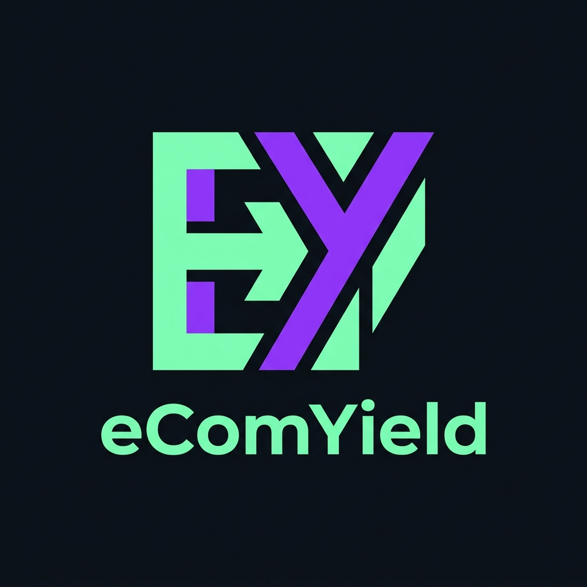

<!-- markdownlint-disable MD033 MD041 -->

<div align="center">



# 🚀 eComYield

### The Solana RWA Protocol for Instant Amazon Seller Liquidity

[](https://opensource.org/licenses/MIT)
[](https://stablehacks.xyz)
[](https://solana.com)
[](https://www.typescriptlang.org)
[](https://nextjs.org)
[](https://bun.sh)

---

<p align="center">
  <strong>Get Paid Today, Not in 21 Days.</strong><br/>
  Turn Amazon receivables into instant cash flow. Up to 80% of daily sales — advanced same day.
</p>

---

## 🛡️ Security & Trust

<div align="center">

|  |  |  |
|:---:|:---:|:---:|
| **Every USDC Backed 1:1** | **All Transactions Verifiable** | **Real-Time Account Health** |

</div>

---

## 🎯 The Problem We Solve

<div align="center">

| Traditional Banking | eComYield |
|:---:|:---:|
| 🔴 **9-23 Days** to get paid | 🟢 **Same Day** instant access |
| 🔴 **Bank Hours 9-5 only** | 🟢 **24/7/365** your money |
| 🔴 Credit check required | 🟢 No credit check needed |

**Amazon holds your money 7-21 days + 1-2 days bank transfer = 9-23 days wait**

</div>

---

## 💰 For Liquidity Providers

### Earn 24-48% APY on USDC

```
┌─────────────────────────────────────────────────────────┐
│  Your Deposit → Seller Advance → 2% Fee → Your Yield   │
│                                                         │
│  2% daily fee × 17 capital turns/year = 34% gross APY  │
│  After protocol fees: 24-48% net APY                   │
└─────────────────────────────────────────────────────────┘
```

| Metric | Value |
|:---|:---|
| 🏊 **Total Pool Size** | $12.4M USDC |
| 👥 **Active Sellers** | 847 |
| 📈 **Advances Today** | $2.1M |
| 📊 **Current APY** | 36% |

---

## ⚡ For Amazon Sellers

### Setup in 2 Minutes

1. **Connect** — Link Amazon Seller Central via SP-API
2. **Verify** — Instant verification through Amazon data (no credit check)
3. **Get Paid** — Set up virtual bank, receive advances same day

| No Credit Check | No Personal Guarantee | Works Globally |
|:---:|:---:|:---:|
| ✅ | ✅ | ✅ |

---

## 🏗️ Tech Stack

<div align="center">

```
┌──────────────────────────────────────────────────────────────┐
│                                                              │
│   Frontend          │   Backend          │   Blockchain     │
│   ─────────────     │   ────────         │   ──────────     │
│   Next.js 16        │   Solana           │   Solana         │
│   TypeScript        │   Anchor           │   SPL Tokens     │
│   Tailwind CSS      │   Rust             │   Anchor         │
│   Framer Motion     │   QuickNode        │   Wallet Adapter │
│   Bun Runtime       │   Helius           │   Phantom        │
│                                                              │
└──────────────────────────────────────────────────────────────┘
```

</div>

---

## 🚀 Quick Start

```bash
# Install dependencies
bun install

# Run development server
bun run dev

# Build for production
bun run build
```

Open [http://localhost:3000](http://localhost:3000) to see the landing page.

---

## 📁 Project Structure

```
ecomyield/
├── public/
│   └── eComYield-logo.jpeg          # Project logo
├── src/
│   ├── app/
│   │   ├── page.tsx                 # Main landing page
│   │   ├── layout.tsx               # Root layout
│   │   └── globals.css              # Global styles
│   └── components/
│       ├── navbar.tsx               # Navigation bar
│       ├── hero-section.tsx         # Hero with 9-23 days highlight
│       ├── easy-setup.tsx           # 2-min setup process
│       ├── yield-showcase.tsx       # LP yield dashboard
│       ├── market-section.tsx       # TAM opportunity
│       ├── competitive-landscape.tsx# vs Storfund/Payability
│       ├── cta-section.tsx          # Final CTA
│       ├── demo-connect.tsx         # Demo Amazon connection modal
│       ├── seller-dashboard.tsx     # Seller dashboard demo
│       └── footer.tsx               # Footer with links
├── package.json
├── tsconfig.json
├── tailwind.config.ts
├── next.config.ts
└── bun.lockb
```

---

## 🔗 Important Links

<div align="center">

| [Demo](https://ecomyield.xyz) | [Solana Docs](https://docs.solana.com) | [SP-API](https://developer.amazonservices.com) |
|:---:|:---:|:---:|
| 🌐 Live Demo | 📖 Blockchain | 🛒 Amazon API |

</div>

---

## 📄 License

<div align="center">

MIT License © 2025 eComYield

**Built for StableHacks** 🏆

</div>

---

<div align="center">

[](https://discord.gg/ecomyield)
[](https://twitter.com/ecomyield)
[](https://github.com/open-biz/eComYield)

</div>

<!-- markdownlint-enable MD033 MD041 -->